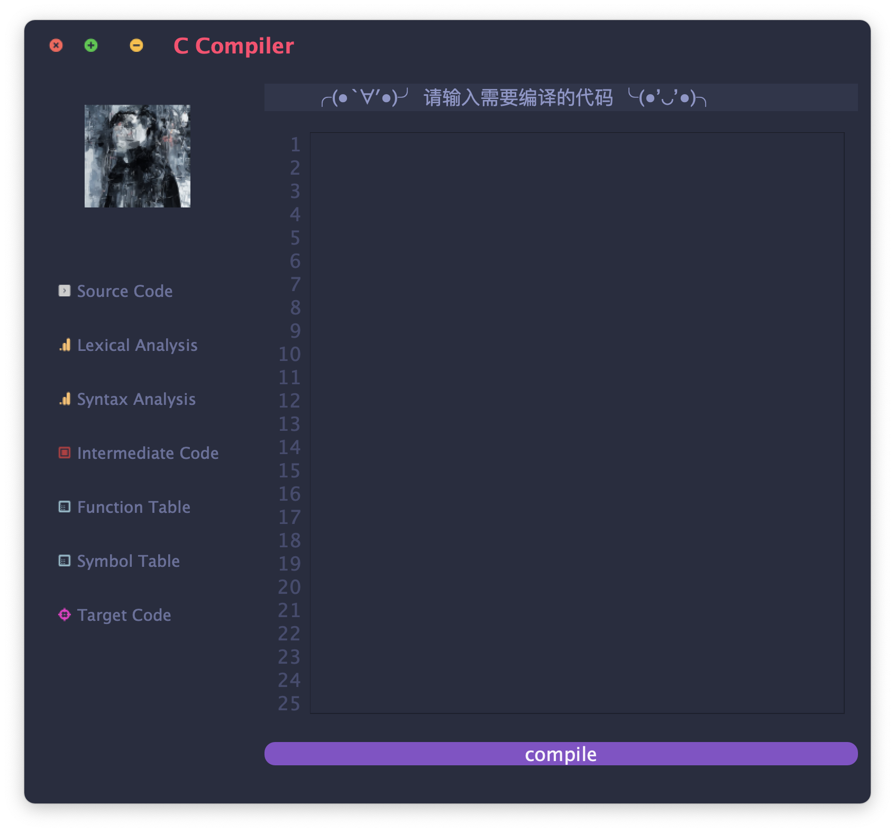
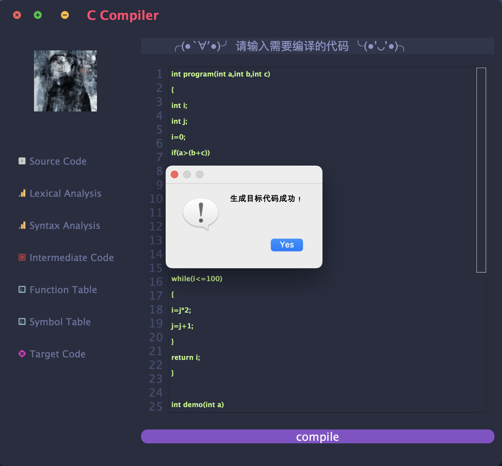
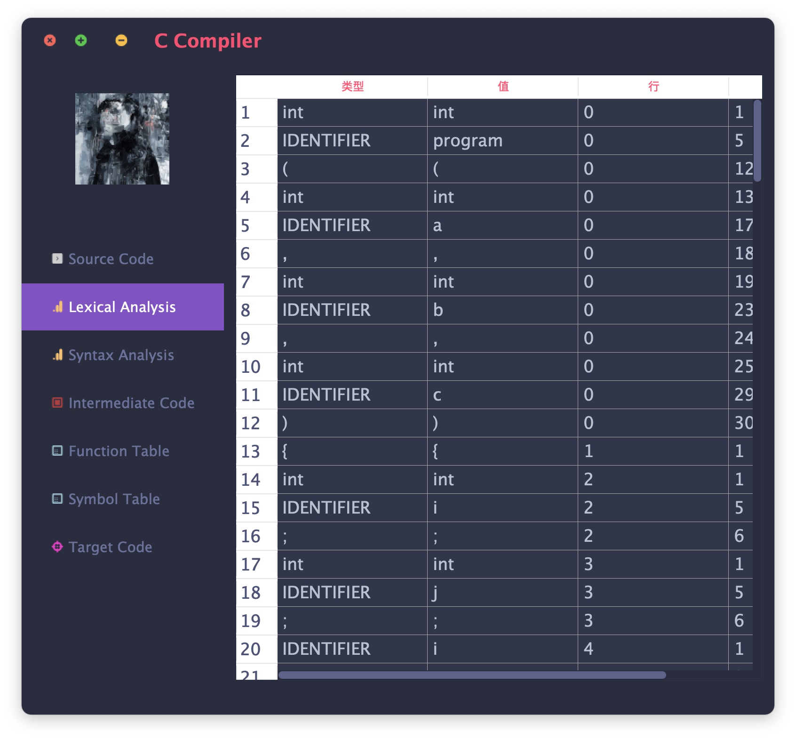
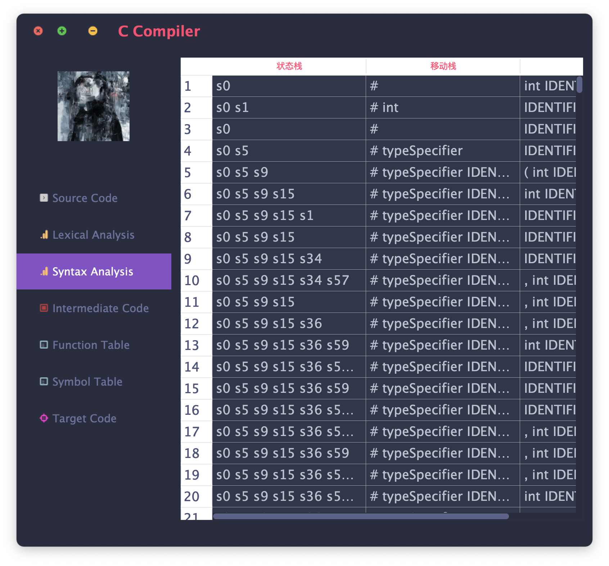
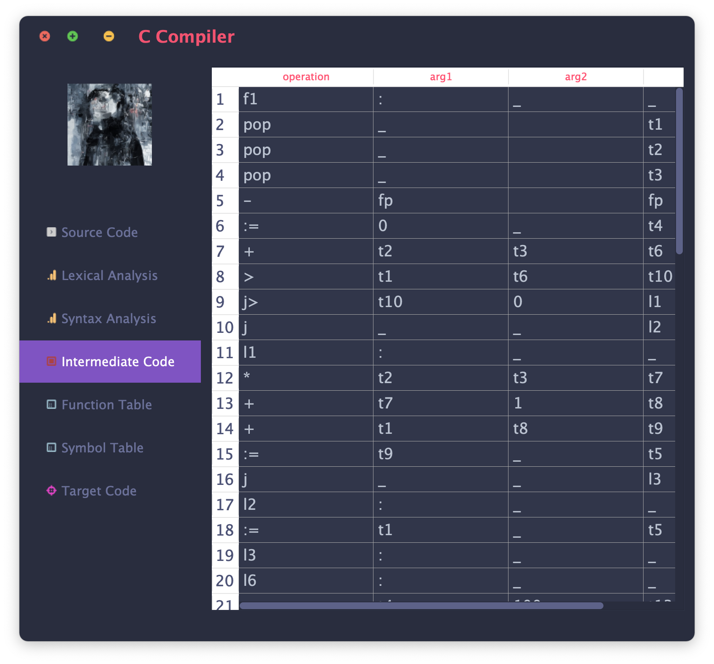
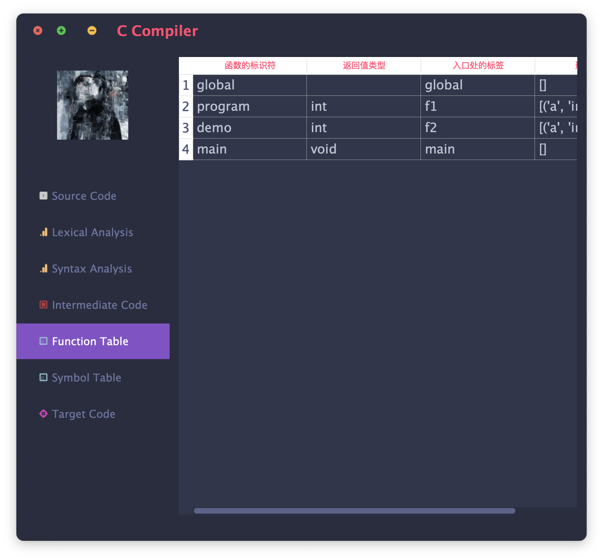
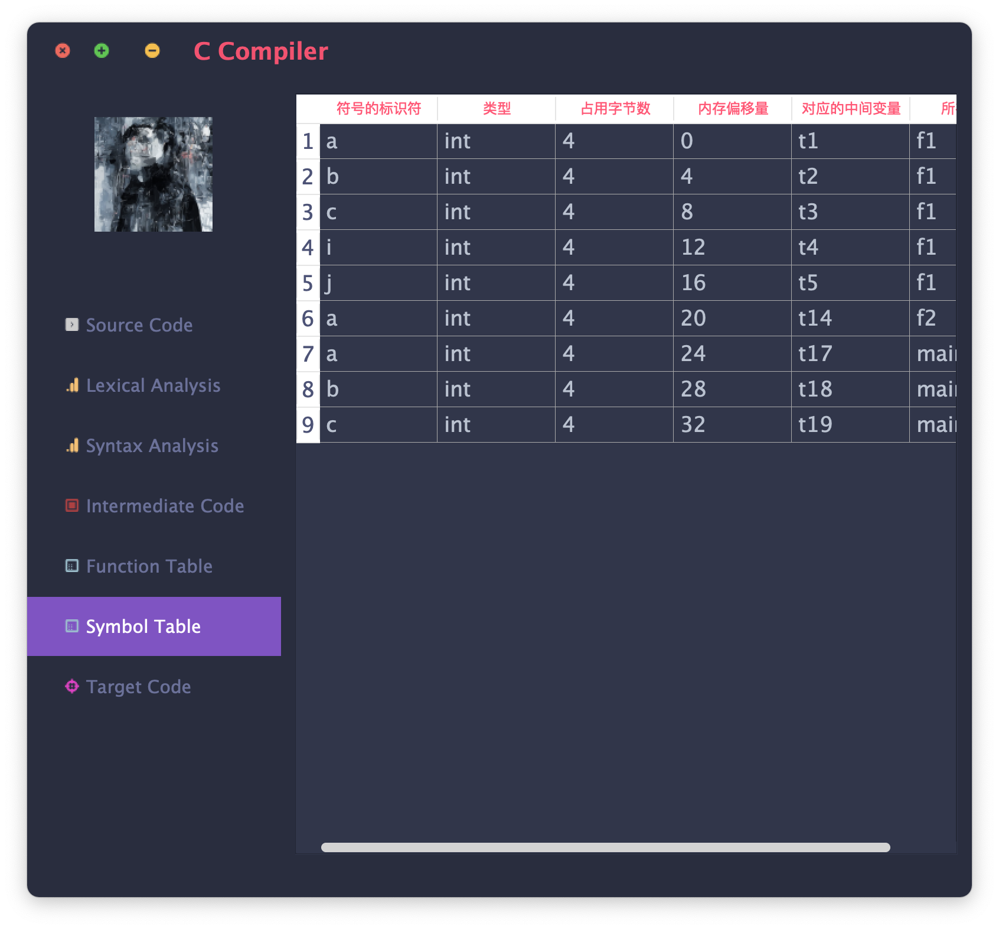
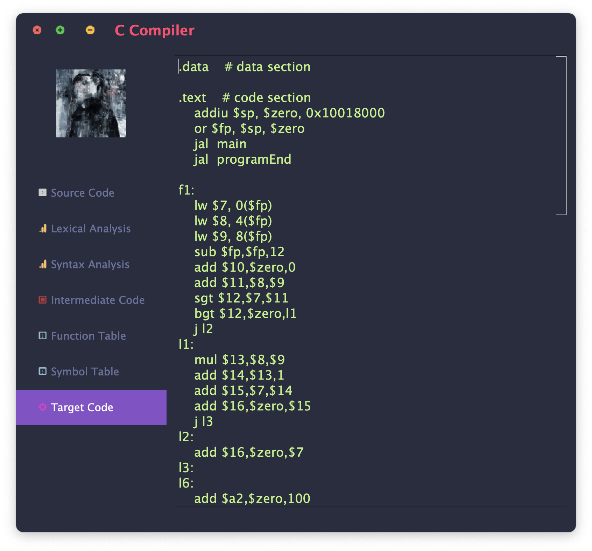

# A C-Like Compiler

 

[](LICENSE)

## Table of Contents

- [A C-like Compiler](#a-c-like-compiler)
  - [Table of Contents](#table-of-contents)
  - [About](#about)
  - [Features](#features)
  - [Getting Started](#getting-started)
    - [Requirements](#requirements)
    - [Installation](#installation)
  - [Examples](#examples)

## About

This is a Python-based C compiler for the "Principles of Compilers" course at Tongji University, introduced by Professor Wei Zhihua.

## Features

- **High-Level Language Implementation:** Developed using Python, it functions as a C-like language compiler with all essential compiler components.
- **Single-Pass Compilation:** A single-pass compiler with lexical analysis as a subordinate component, called as needed by the syntax analysis.
- **Syntax-Directed Translation:** Simultaneously generates intermediate code during syntax analysis, saving it to a file.
- **C-Like Language Support:** Processes C-like source code, generating programs in intermediate code.
- **Target Code Generation:** Transforms C-like source code into executable target code, often in the form of assembly language.
- **Procedure and Function Calls:** Handles compilation of procedures and functions, ensuring correct program logic and structure translation.
- **Extended Grammar:** Extends the C-like language grammar to include arrays in intermediate code and facilitates target code generation with arrays.

## Getting Started

### Requirements

- Python 3.9.7
- QtAwesome 1.0.2

### Installation

```bash
# Example installation steps
git clone https://github.com/yourusername/your-compiler.git
cd your-compiler
```

## Examples















